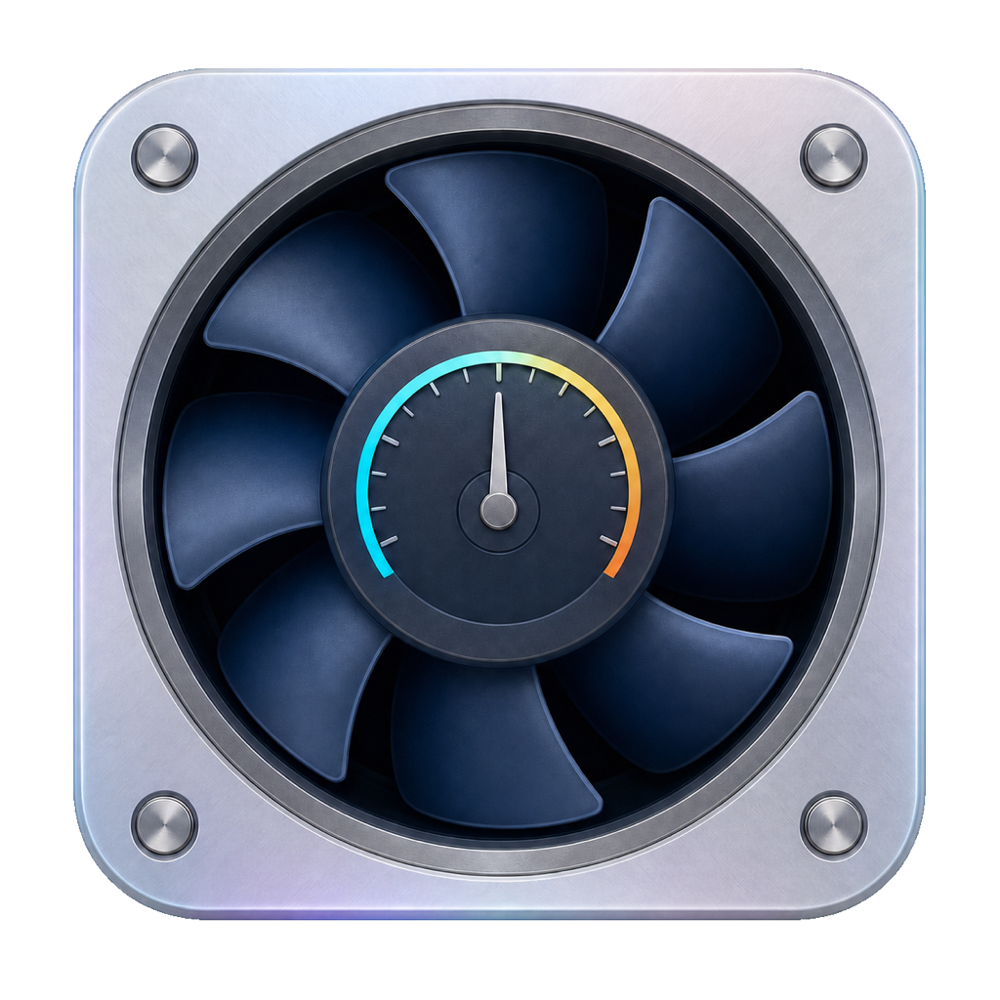

<p align="center">
  
</p>

<h1 align="center">MFanControl</h1>

<p align="center">
  A source-only, safety-first macOS menu-bar utility for Apple Silicon fan
  telemetry and bounded fixed-RPM control.
</p>

<p align="center">
  <a href="https://www.apple.com/macos/"></a>
  <a href="https://www.swift.org/"></a>
  <a href="LICENSE"></a>
  
</p>

> [!CAUTION]
> Manual fan control overrides part of macOS thermal policy and can damage
> hardware. MFanControl is experimental, unaffiliated with Apple, and provided
> without warranty. Do not enable manual control until the read-only probe and
> the complete hardware-validation gate have passed on your exact model and
> macOS build.

## Project status

MFanControl is an active development snapshot, not a stable release. The
project does not publish official, prebuilt, notarized, or signed binaries.
Every user builds the app and helper package locally from source.

The initial validation target is the M3 Pro MacBook Pro identified as
`Mac15,7`. That model is still marked **experimental** until every documented
hardware-safety test passes on the current macOS build.

| Hardware | Status | Notes |
| --- | --- | --- |
| `Mac15,7` / M3 Pro | Experimental | Primary probe and validation target |
| Other fan-equipped Apple Silicon Macs | Experimental or unsupported | Known keys are probed; no key-space scanning or guessed write strategy |
| Intel Macs | Unsupported | Outside the project scope |

Software tests passing does not make a hardware profile verified.

## What it currently provides

- A compact SwiftUI `MenuBarExtra` with CPU maximum temperature.
- Per-fan actual, target, minimum, and maximum RPM telemetry.
- Auto, Quiet, Balanced, and Cool fixed-RPM presets.
- Manual per-fan RPM controls behind a disclosure.
- Editable preset percentages and sensor/helper settings.
- A privileged launchd helper installed through the standard macOS Installer.
- A typed, bounded XPC request channel between the app and helper.
- A read-only hardware probe limited to known fan-control keys.
- Automatic recovery to macOS control after the documented safety events.
- Unit tests for SMC codecs, protocol boundaries, helper lifecycle, policy,
  control, and safety transitions.

### Non-goals

- Temperature-dependent fan curves.
- App-, power-, or schedule-based profiles.
- Arbitrary SMC reads or writes through the UI or IPC.
- Intel support.
- Official binary releases, notarization, DMG, or App Store distribution.
- Automatically restoring a manual mode after launch, reconnect, or wake.

## Safety model

MFanControl keeps the writable surface deliberately narrow:

- The app can send only `hello`, `status`, `setManual`, `setPreset`,
  `setAutomatic`, `setAllAutomatic`, `heartbeat`, and `shutdown`.
- Requests and responses use the shared bounded codec; payloads are limited to
  4 KiB.
- The privileged XPC service requires the app bundle identifier
  `io.clover.mfancontrol`, an Apple-trusted signature, and the same Team ID as
  the helper.
- RPM targets must be nonzero and inside the current SMC-reported minimum and
  maximum.
- Manual-mode writes and target RPM are verified by readback.
- If direct M3/M4 mode control is rejected, the documented `Ftst` fallback is
  bounded by time and retries.
- Preset application is transactional: a partial failure returns every fan to
  Auto.
- Disconnect, heartbeat loss over five seconds, sleep, serious or critical
  thermal pressure, `SIGINT`, `SIGTERM`, and orderly shutdown return all fans
  to Auto.
- Wake never reapplies a preset or manual speed.
- `Ftst=0` is written only when this process previously acquired `Ftst`.
- No active manual state is persisted.

`kill -9` cannot be caught by userspace. The hardware gate therefore includes a
separate test proving macOS reclaims fan control after a forced helper
termination. See [docs/SAFETY.md](docs/SAFETY.md) for the complete contract.

## Requirements

- A fan-equipped Apple Silicon Mac.
- macOS 15 or newer.
- Xcode beta installed at `/Applications/Xcode-beta.app`.
- A Swift 6.2-compatible toolchain.
- An Apple Development signing identity for functional privileged XPC.

The Makefile sets `DEVELOPER_DIR` per command. It does not modify the global
`xcode-select` configuration.

## Build from source

Clone the repository and run:

```sh
git clone https://github.com/huntly-digital/mac-fan-control.git
cd mac-fan-control
make build
```

`make build` runs the unit tests and creates a release SwiftPM build.

Generate the app icon after changing its source:

```sh
./script/generate_app_icon.sh
```

Build the helper package and app bundle:

```sh
make helper-pkg
make app
make verify-app
```

Outputs:

```text
Products/MFanControlHelper.pkg
Products/MFanControl.app
```

### Code signing

Packaging uses ad-hoc signing by default. That is sufficient for inspecting
the bundle and package structure, but the privileged XPC service requires an
Apple Development Team signature.

List available identities:

```sh
security find-identity -v -p codesigning
```

Then build the app and helper with the same identity:

```sh
CODE_SIGN_IDENTITY="Apple Development: Your Name (TEAMID)" make verify-app
```

The component package itself is unsigned because it is generated and used
locally. A signed distribution package would require a Developer ID Installer
certificate, which is intentionally outside the source-only workflow.

## Install and run

Open the local build:

```sh
open Products/MFanControl.app
```

When the helper is absent:

1. Select **Install Helper** in MFanControl.
2. Complete the standard macOS Installer flow and administrator prompt.
3. Return to MFanControl and select **Check Again**.

The package installs only:

```text
/Library/PrivilegedHelperTools/io.clover.mfancontrol.helper
/Library/LaunchDaemons/io.clover.mfancontrol.helper.plist
```

The app reports a connected state only after the helper executable exists and
a typed XPC ping returns the expected protocol version.

The local development entry point is:

```sh
./script/build_and_run.sh
```

Supported modes are `--debug`, `--logs`, `--telemetry`, and `--verify`.

## Using MFanControl

- **Auto** returns all fans to macOS control.
- **Quiet**, **Balanced**, and **Cool** calculate a target independently for
  each fan from its current minimum and maximum.
- **Manual control** applies one bounded target to one fan.
- **Settings → Presets** changes the persisted preset percentages.
- **Settings → Sensors** shows the validated CPU, GPU, and battery readings
  available for the current model.
- **Settings → Helper** reports installation and XPC state.

Preset targets use:

```text
target = roundTo100(minimum + percentage × (maximum - minimum))
```

Defaults are Quiet 10%, Balanced 30%, and Cool 55%. The percentages persist;
the active preset does not.

An actual reading of `0 RPM` is valid when macOS has stopped an idle fan.
System mode is displayed separately from automatic and manual modes.

## Return to automatic control

Use **Auto** in the menu before quitting or changing the helper. An orderly app
disconnect or helper stop also asks the controller to restore Auto.

If the UI is unavailable, stop a manually started development daemon with
`Ctrl+C`. Never experiment with raw SMC writes as a recovery method.

## Read-only probe

Run the probe before any model-specific write validation:

```sh
make probe
```

The JSON output contains only:

- hardware model and processor name;
- fan count and selected support strategy;
- known `F%dAc`, `F%dTg`, `F%dMn`, `F%dMx`, `F%dMd`, `F%dmd`, and `Ftst`
  values when present.

The probe does not enumerate the SMC keyspace or print serial numbers, UUIDs,
account names, or other direct identifiers.

The anonymized target fixture is stored at
`Tests/HardwareTests/Fixtures/Mac15,7.json`.

## Hardware-validation gate

Read-only hardware tests require explicit opt-in:

```sh
MFAN_HARDWARE_TESTS=1 make test
```

There are no automatic write hardware tests. Root write validation is manual
and begins at `minimum + 500 RPM`, or the smaller valid target. The complete
gate must cover:

1. One Auto → Manual → Auto cycle with RPM verification.
2. Twenty consecutive cycles with no fan left in manual mode.
3. App disconnect returning Auto within five seconds.
4. Helper termination and orderly shutdown.
5. Sleep and wake without restoring manual control.
6. Serious and critical thermal-pressure recovery.
7. A separate `kill -9` reclaim test proving macOS restores system control
   within 15 seconds.

Do not change a model from experimental to verified until the full gate passes
on the current macOS build.

## Architecture

```text
MFanControl.app
  SwiftUI MenuBarExtra
  FanStore / PresetStore / HelperStore
              |
              | typed, bounded NSXPC request
              v
io.clover.mfancontrol.helper (root launchd service)
  HelperXPCService
  RequestProcessor / SafetyStateMachine
  FanController
              |
              | typed known-key access
              v
          SMCBridge
```

The manual Unix-domain socket daemon remains a development-only path. See
[docs/ARCHITECTURE.md](docs/ARCHITECTURE.md) for module boundaries and data
flow.

## Repository layout

```text
Sources/
  SMCBridge             typed AppleSMC transport and codecs
  FanProtocol           shared commands, models, and bounded JSONL codec
  HelperProtocol        narrow Objective-C-compatible XPC interface
  HelperServiceCore     privileged XPC service and lifecycle hooks
  HelperManagement      app-side helper installation and XPC clients
  FanCore               hardware discovery, policy, control, and safety
  FanDaemonCore         request processor and development socket server
  fancontrold           probe, development daemon, and helper entry point
  MFanControlApp        SwiftUI menu-bar app
Tests/                  unit and opt-in hardware tests
Resources/              plist files, helper package resources, and app icon
script/                 build, package, run, and verification scripts
```

## Development and tests

Run all non-hardware tests:

```sh
make test
```

The equivalent sandbox-compatible command is:

```sh
DEVELOPER_DIR=/Applications/Xcode-beta.app/Contents/Developer \
CLANG_MODULE_CACHE_PATH=/tmp/mfan-clang-cache \
SWIFTPM_MODULECACHE_OVERRIDE=/tmp/mfan-swiftpm-cache \
xcrun swift test --disable-sandbox
```

Run a release build:

```sh
make release
```

Before submitting changes, read [CONTRIBUTING.md](CONTRIBUTING.md) and
[docs/SAFETY.md](docs/SAFETY.md).

## Troubleshooting

### Helper is installed but unavailable

Inspect launchd without changing it:

```sh
sudo launchctl print system/io.clover.mfancontrol.helper
```

Rebuild the app and helper with the same Apple Development identity, run the
Installer again, and select **Check Again**.

### Installer package is missing

Rebuild the app:

```sh
make app
```

The app expects the package at
`Contents/Resources/MFanControlHelper.pkg`.

### Stale development socket

First confirm that no development daemon is running:

```sh
pgrep -x fancontrold
```

Only then remove the socket for the current UID:

```sh
sudo rm "/var/run/mfancontrol-$(id -u).sock"
```

### Remove the locally installed helper

Return all fans to Auto first. Then remove only the documented launchd job and
files:

```sh
sudo launchctl bootout system/io.clover.mfancontrol.helper
sudo rm /Library/PrivilegedHelperTools/io.clover.mfancontrol.helper
sudo rm /Library/LaunchDaemons/io.clover.mfancontrol.helper.plist
```

These commands do not remove the source checkout or `MFanControl.app`.

## Contributing, security, and support

- Read [CONTRIBUTING.md](CONTRIBUTING.md) before opening a pull request.
- Follow the [Code of Conduct](CODE_OF_CONDUCT.md).
- Report vulnerabilities according to [SECURITY.md](SECURITY.md).
- Use [SUPPORT.md](SUPPORT.md) for compatibility and installation questions.
- See [CHANGELOG.md](CHANGELOG.md) for the development history.

## License and attribution

MFanControl is available under the [MIT License](LICENSE).
